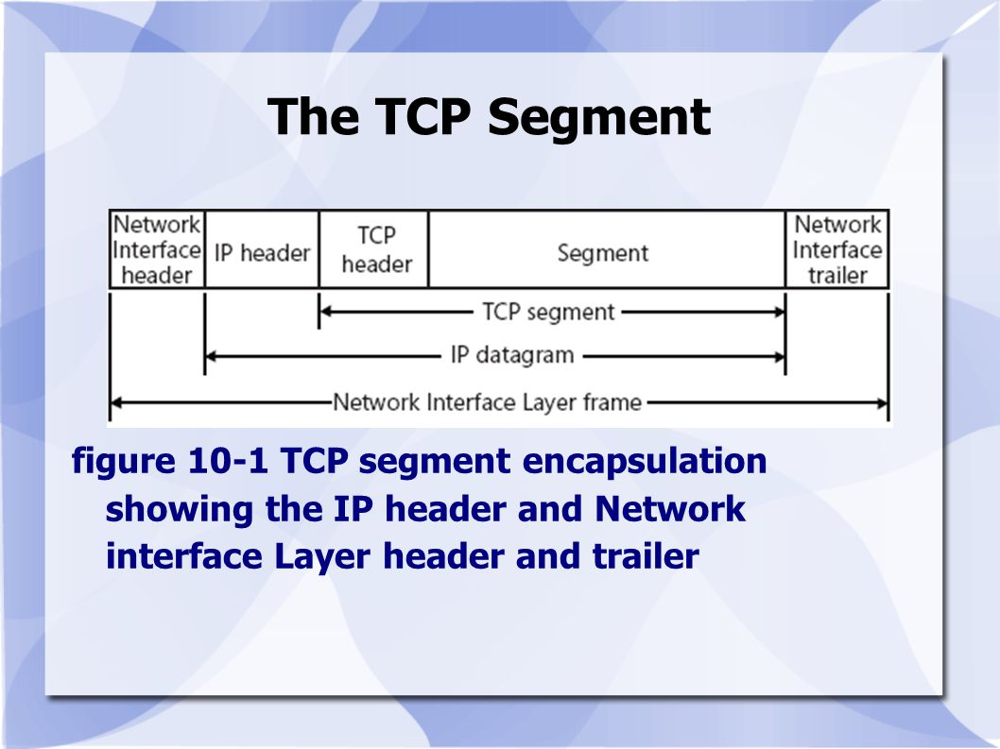

# TCP

## TCP 개념
- Transmission Control Protocol
- 양종단 호스트 내 프로세스 상호 간에 신뢰적인 연결지향성 서비스를 제공하는 전송 계층 프로토콜
- TCP(티씨피)는 "Transmission Control Protocol"의 약자로서, 인터넷에서 사용되는 표준 통신 프로토콜이다. 한국어로 번역하면, 전송 제어 프로토콜이라는 뜻이다. 흔히 TCP와 IP를 결합하여, TCP/IP라고 사용한다. 
- 전송 계층(Transport Layer)에서 사용되는 프로토콜로는 대표적으로 TCP와 UDP가 있다.
  - TCP가 1:1 연결을 통해 안전하게 데이터 를 교환하는 것과 달리, UDP는 1:N 방식으로 한쪽에서 다른 쪽으로 일방적으로 데이터를 전송한다. TCP가 전화와 비슷하다면, UDP는 일방적으로 보내는 소포와 비슷하다.
  - 비교적 간단하고 빠른 UDP에 비해 TCP는 더 복잡하고 느리지만, 보다 신뢰성있는 연결이 가능해진다.
  - TCP와 UDP는 포트 번호를 이용하여 주소를 지정하는것과 데이터 오류검사를 위한 체크섬 존재하는 두가지 공통점을 가지고 있지만 정확성(TCP)을 추구할지 신속성(UDP)을 추구할지를 구분하여 나뉜다.

- 참고**
  - 전송 계층은 송신자와 수신자를 연결하는 통신 서비스를 제공하고 IP에 의해 전달되는 패킷의 오류를 검사하며 재전송 요구 제어등을 담당하는 계층이다.
  - 다시말해 데이터의 전달을 담당한다.

<br/>

## TCP 특징
- 신뢰성 있는 연결을 지향한다.
- 세그먼트에 순번을 지정하여 데이터의 순서를 유지한다.
- 3-Way Handshaking을 통해 연결하고 4-Way Handshaking을 통해 연결을 종료한다.

<br/>

## TCP 세그먼트

- TCP 세그먼트는 TCP로 연결된 세션간의 전달되는 데이터 단위
- TCP는 데이터 스트림으로부터 데이터를 받아 들여 이것을 일정 단위로 분할한 뒤 TCP 헤더를 덧붙여 TCP 세그먼트를 생성한다. TCP 세그먼트는 *IP 데이터그램에 캡슐화되어 상대방과 주고 받게 된다.
  ```
  TCP 세그먼트 =  세그먼트 헤더(TCP 헤더) + 데이터
  ```
  ```
  TCP 페이로드 세그먼트 크기 =  (IP헤더의 Total Length) - (IP 헤더의 Header Length) - (TCP헤더의 Header Length)
  ```

<br/>

## TCP 헤더


- Source Port (16 비트) : 출발지 포트번호, 송신 포트
- Destination Port (16 비트) : 목적지 포트번호, 수신 포트
- Sequence Number (32 비트) : 바이트 단위로 순서화되는 번호로, 이것을 통해 신뢰성(3-Way Handshake) 및 흐름제어(sliding Window) 기능 제공
- Acknowledgment Number (32 비트) : 수신하기를 기대하는 다음 byte 번호 (마지막으로 수신에 성공한 번호의 +1)
- Data Offset(HLEN) (4 비트): 헤더 길이 필드이며 IPv4와 마찬가지로 나누기 4 계산 후 2진수로 작성됨
- Reserved (3 비트): 예약된 필드, 현재 사용되지 않음
- Flags(TCP 제어 플래그) (9 비트) : 현재 세그먼트의 속성을 나타내며, 기존에는 6개의 플래그만을 사용했지만, 혼잡 제어 기능의 향상을 위해 Reserved 필드를 사용하여 NS, CWR, ECE 플래그가 추가되었음
    |필드|의미|
    |---|---|
    |URG|Urgent Pointer(긴급 포인터) 필드에 값이 채워져있음을 알리는 플래그. 이 포인터가 가리키는 긴급한 데이터는 높게 처리되어 먼저 처리됨. 요즘에는 많이 사용되지 않음.|
    |ACK|Acknowledgment(승인 번호) 필드에 값이 채워져있음을 알리는 플래그. 이 플래그가 0이라면 승인 번호 필드 자체가 무시됨.|
    |PSH|Push 플래그. 수신 측에게 이 데이터를 최대한 빠르게 응용프로그램에게 전달해달라는 플래그. 이 플래그가 0이라면 수신 측은 자신의 버퍼가 다 채워질 때까지 기다림. 즉, 이 플래그가 1이라면 이 세그먼트 이후에 더 이상 연결된 세그먼트가 없음을 의미.|
    |RST|Reset 플래그. 이미 연결이 확립되어 ESTABLISHED 상태인 상대방에게 연결을 강제로 리셋해달라는 요청의 의미.|
    |SYN|Synchronize 플래그. 상대방과 연결을 생성할 때, 시퀀스 번호의 동기화를 맞추기 위한 세그먼트임을 의미.|
    |FIN|Finish 플래그. 상대방과 연결을 종료하고 싶다는 요청인 세그먼트임을 의미.|
    |||
    |NS|ECN에서 사용하는 CWR, ECE 필드가 실수나 악의적으로 은폐되는 경우를 방어하기 위해 RFC 3540에서 추가된 필드|
    |ECE|ECN Echo 플래그. 해당 필드가 1이면서, SYN 플래그가 1일 때는 ECN을 사용한다고 상대방에게 알리는 의미. SYN 플래그가 0이라면 네트워크가 혼잡하니 세그먼트 윈도우의 크기를 줄여달라는 요청의 의미.|
    |CWR|이미 ECE 플래그를 받아서, 전송하는 세그먼트 윈도우의 크기를 줄였다는 의미.|

- Window size : 자신의 수신 버퍼 여유용량 크기를 통보하여 얼마만큼의 데이터를 받을 수 있는지 상대방에게 알려주어 흐름제어를 수행하게 되는 필드
- Checksum : 헤더 및 데이터의 에러 확인을 위해 사용되는필드
- Urgent Pointer : 어디서부터 긴급 값인지 알려주는 플래그 (TCP Flags의 U와 세트)
- Options : 옵션 필드는 TCP의 기능을 확장할 때 사용하는 필드로, 크기가 고정된 것이 아니라 가변적
- Padding : TCP 헤더의 종료 지점과 데이터의 시작 지점을 32 비트 단위 길이에 맞추기 위해 사용

<br/>

## 3 way handshake 

<br/>

## 4 way handshake

<br/>

## 👍 참조사이트
