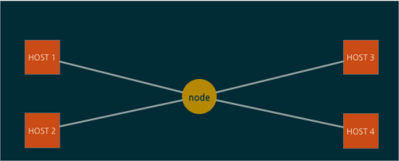
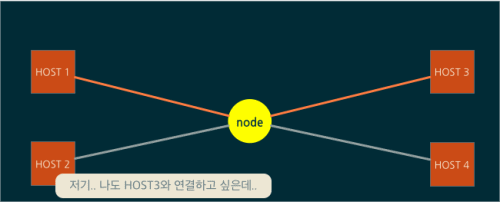
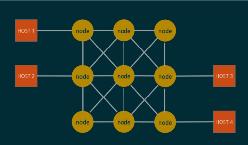
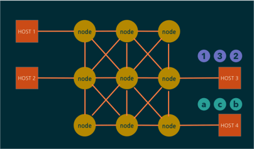

# TCP/IP

## 데이터 통신의 발전

#### 서킷 통신
- 처음 인터넷이 생기기전까지 통신을 하기 위해서는 양쪽에서의 연결이 필요했다.
- 연결이 이루어지게 되면 연결이 끊어질 때까지 해당 회선을 독점하여 사용한다.
- 통신을 하려고하는 양쪽이 1대1로 연결되어야 하며, 양쪽이 직접적으로 연결되거나 중간 교환소를 통해 연결되었다.

- 하지만 연결중에는 해당 회선을 완전히 점유하기 때문에 다른 연결이 불가능했다.
- 다른 연결을 위해서는 이미 연결된 곳이 끊어질 때까지 기다려야 했다.

#### 여러개의 노드로 망 다중화
- 서킷 통신을 해결하기 위해서는 망을 여러개 만들면 된다.
- 망을 여러개 만든 경우 중간에 연결이 끊어지더라도 다시 연결할 수 있다.
- 하지만 중간에 연결이 끊어지는 경우 다시 연결을 해야하며, 연결 가능한 망을 찾아 다시 연결해야하기 때문에 효율적이지 않다.

#### 패킷통신
- 데이터를 작게 잘라 보낸다.
- 작게 잘린 데이터 조각들이 각각 목적지로 향하기 때문에 효율적이다.
- 하지만 작게 나누어 보내면 순서가 뒤섞이거나 누락되는 데이터가 발생할 수 있다.

- 따라서 패킷 통신 이후 데이터를 받은 곳에서 점검을 해서 순서를 정렬하거나 빠진 내용을 다시 받으면 된다. 

## TCP/IP 개념
- 인터넷 프로토콜 스위트(영어: Internet Protocol Suite)는 인터넷에서 컴퓨터들이 서로 정보를 주고받는 데 쓰이는 통신규약(프로토콜)의 모음이다. 인터넷 프로토콜 슈트 중 TCP와 IP가 가장 많이 쓰이기 때문에 TCP/IP 프로토콜 슈트라고도 불린다.
- TCP/IP는 패킷 통신 방식의 인터넷 프로토콜인 IP (인터넷 프로토콜)와 전송 조절 프로토콜인 TCP (전송 제어 프로토콜)로 이루어져 있다. 
- IP는 패킷 전달 여부를 보증하지 않고, 패킷을 보낸 순서와 받는 순서가 다를 수 있다.(unreliable datagram service) TCP는 IP 위에서 동작하는 프로토콜로, 데이터의 전달을 보증하고 보낸 순서대로 받게 해준다. 
  - IP는 복잡한 네트워크 망에서 효율적으로 데이터를 보낸다. 즉, 데이터를 작은 조각으로 빨리 보내는 것이 중요
  - TCP는 IP가 작게 잘라 보낸 데이터의 순서와 누락된 데이터를 점검하여 다시 요청한다.
- HTTP, FTP, SMTP 등 TCP를 기반으로 한 많은 수의 애플리케이션 프로토콜들이 IP 위에서 동작하기 때문에, 묶어서 TCP/IP로 부르기도 한다.
    - HTTP, FTP, SMTP 등은 웹이나 여러 데이터를 주고 받기 위한 프로토콜이다.

 

## 흐름제어
- 수신측이 송신측보다 데이터 처리 속도가 빠르면 문제없지만, 송신측의 속도가 빠를 경우 문제가 생긴다.
- 수신측에서 제한된 저장 용량을 초과한 이후에 도착하는 데이터는 손실 될 수 있으며, 만약 손실 된다면 불필요하게 응답과 데이터 전송이 송/수신 측 간에 빈번이 발생한다.
- 이러한 위험을 줄이기 위해 송신 측의 데이터 전송량을 수신측에 따라 조절해야한다.
  
#### 1. Stop and Wait

#### 2. 슬라이딩 윈도우(Go Back N APQ)

 

## 혼잡제어
- 송신측의 데이터는 지역망이나 인터넷으로 연결된 대형 네트워크를 통해 전달된다. 만약 한 라우터에 데이터가 몰릴 경우, 자신에게 온 데이터를 모두 처리할 수 없게 된다. 이런 경우 호스트들은 또 다시 재전송을 하게되고 결국 혼잡만 가중시켜 오버플로우나 데이터 손신을 발생시키게 된다. 따라서 이러한 네트워크의 혼잡을 피하기 우해 송신측에서 보내는 데이터의 전송속도를 강제로 줄이게 되는데, 이러한 작업을 혼잡제어라고 한다.
- 또한 네트워크 내에 패킷의 수가 과도하게 증가하는 현상을 혼잡이라 하며, 혼잡 현상을 방지하거나 제거하는 기능을 혼잡제어라고 한다.
- 흐름제어가 송신측과 수신측 사이의 전송속도를 다루는데 반해, 혼잡제어는 호스트와 라우터를포함한 보다 넓은 관점에서 전송 문제를 다루게 된다.

#### 1. AIMD (Additive Increase / Multiplicative Decrease)

#### 2. Slow Start

#### 3. Fast Retransmit

 

## 👍 참조사이트
- https://brunch.co.kr/@wangho/6
- https://aws-hyoh.tistory.com/entry/TCPIP-%EC%89%BD%EA%B2%8C-%EC%9D%B4%ED%95%B4%ED%95%98%EA%B8%B0
- https://gyoogle.dev/blog/computer-science/network/%ED%9D%90%EB%A6%84%EC%A0%9C%EC%96%B4%20&%20%ED%98%BC%EC%9E%A1%EC%A0%9C%EC%96%B4.html
- https://ko.wikipedia.org/wiki/%EC%9D%B8%ED%84%B0%EB%84%B7_%ED%94%84%EB%A1%9C%ED%86%A0%EC%BD%9C_%EC%8A%A4%EC%9C%84%ED%8A%B8

## 이미지 출처
- 데이터 통신 그림 : 낭만기획 블로그(https://brunch.co.kr/@wangho/6)